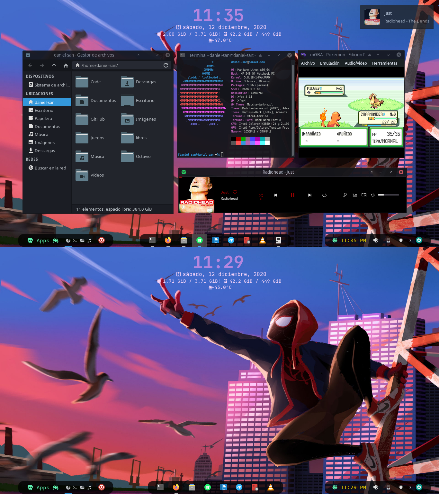

# xfce-config
mi configuración del escritorio Xfce



- Tema: [Matcha Dark Azul](https://github.com/vinceliuice/Matcha-gtk-theme)

- Iconos: [Papirus-Dark](https://github.com/PapirusDevelopmentTeam/papirus-icon-theme) + Folder Color

- Fonts: [Font Awesome](https://fontawesome.com/) + [Nerd Font](https://www.nerdfonts.com/)

- Conky

- Spotify + [Spicetify](https://github.com/khanhas/spicetify-cli)

- Complementos del Panel: Para más información sobre personalizar el panel  de xfce [aqui](https://docs.xfce.org/xfce/xfce4-panel/theming)

    - [docklike](https://github.com/nsz32/docklike-plugin)

    - Whiskermenu: Propiedades > Boton del Panel > Titulo

        ```
        <span font_desc = "Font Awesome 5 Free Solid   12"  foreground = "#61F6B5"  >  skull  </span><span font_desc = "Source Code Pro   12"  foreground = "#61F6B5" >Apps </span><span font_desc = "Font Awesome 5 Free Solid   12"  foreground = "#61F6B5"  >spider   </span>
        ```

    - Reloj: Propiedades > Formato > Formato Personalizado

        ```
        <span font_desc = "Font Awesome 5 Free Solid   12"  foreground = "#61F6B5"  > sun</span><span font_desc = "Source Code Pro   12"   foreground = "#FFF000" > %I:%M %p</span>   
        ```
    
    - Pupitre: Tengo 4 Areas de Trabajo con los siguientes caracteres:

        -   ,    , , , 


    


